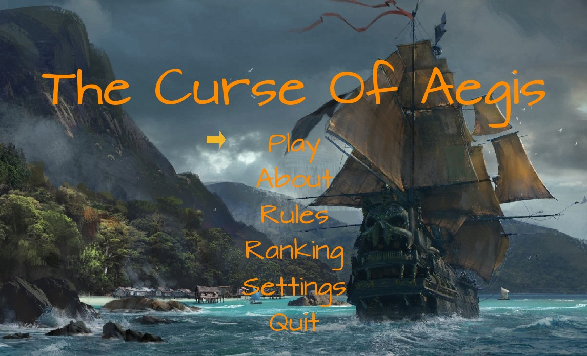
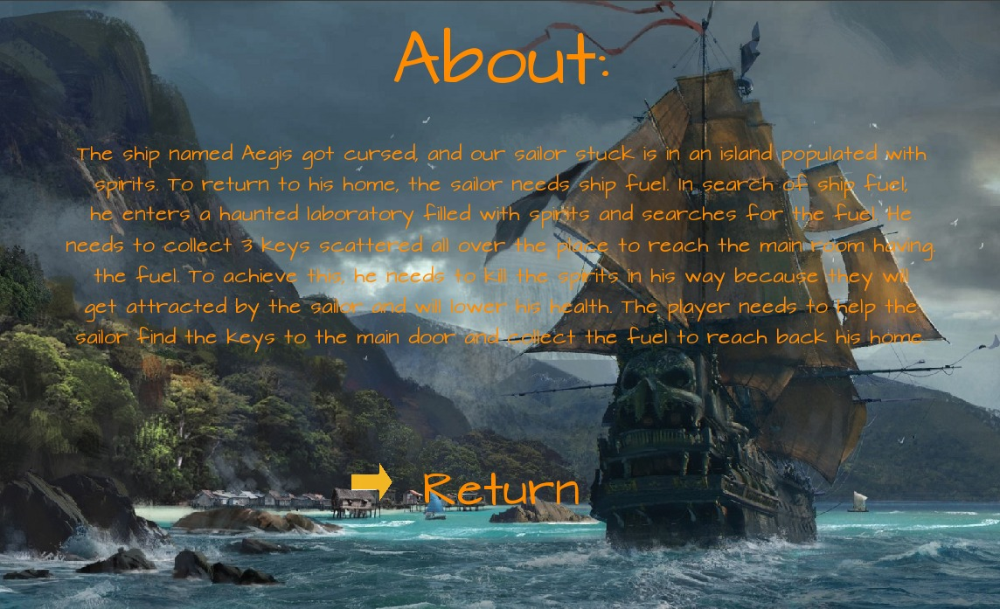
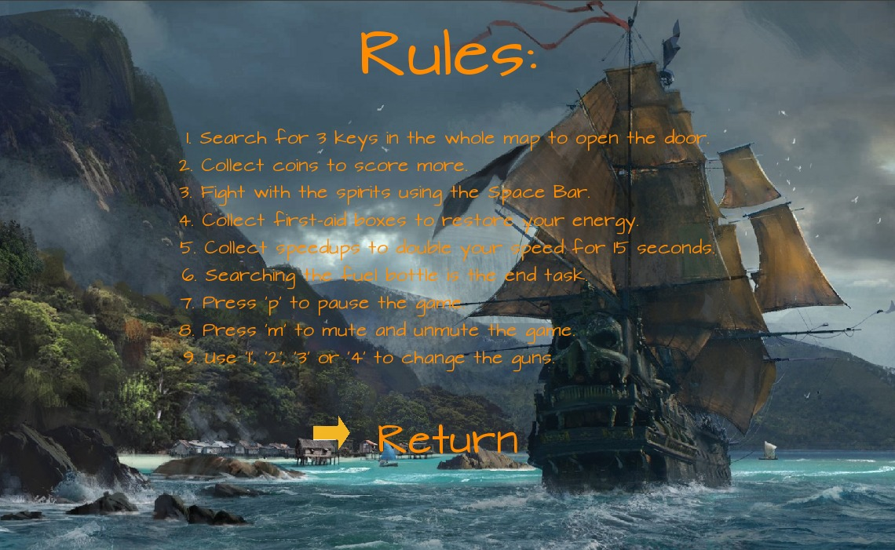
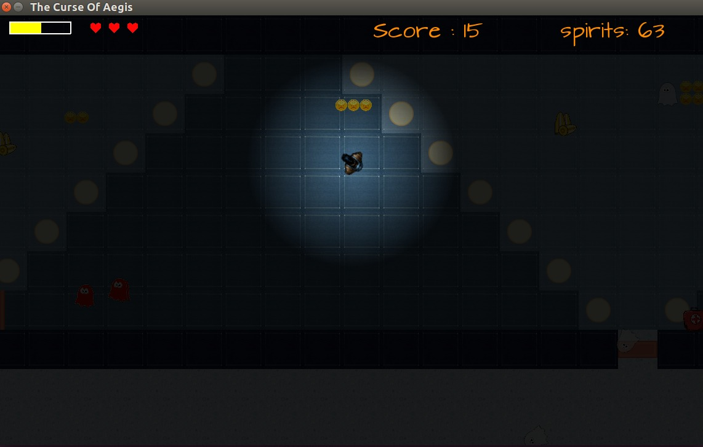

# The Curse of Aegis
The player is stuck in the island. He had been cursed during a storm and landed up on an island to save his life and break the curse. He needs ship fuel to sail back to his country. In search of the ship fuel he entered a haunted laboratory. The player/user needs to guide the sailor to find the fuel and return safely. Firstly the player can select among what type of level he want to play based on the hardness. The laboratory contains some compartments as well in which the sailor needs to kill the spirits because they will get attracted by the sailor and lower his health. The laboratory consists of opened compartments and one locked compartment which require 3 keys to be opened. Player needs to find the keys to unlock it and finally when he has the ship's fuel bottle in his hand with one or more extra lives, he will succeed and win the game.

## Rules
1. A locked compartment containing the ship fuel can only be opened if the player has 3 keys to that particular compartment.
2. If the player collides with the spirit it will lower his energy. If the energy gets exhausted, one life will be decreased until all lives disappear.
3. The speedups will increase the speed of the sailor for 15 seconds then it will be back to its original speed.
4. The player can shoot the spirits and they will die when their energy gets exhausted.
5. Once the player collects the ship fuel game will be over and he will win the game.
6. If the player uses up all the 3 lives, he will die and lose the game.

## Keyboard Keys
The game is a solely keyboad based game. Following keys needs to be used:

#### W or UP arrow key       - To move Forward
#### S or DOWN arrow key     - To move Backward
#### D or RIGHT arrow key    - To move Right
#### A or LEFT arrow ley     - To move Left
#### M                       - To mute or unmute the sounds in the game
#### P                       - To pause the game
#### ESC                     - To quit the game

## How to run the Game
Follow the given steps : 
1. Create a virtualenv.
2. Run: `pip install -r requirements.txt` in your shell.
3. Run: `python3 run.py` in your shell.

## Screenshots
#### Game Menu Screen :

#### About the Game Screen :

#### Game Rules Screen :

#### Game Play Screen : 
# The-Curse-of-Aegis
# The-Curse-of-Aegis
